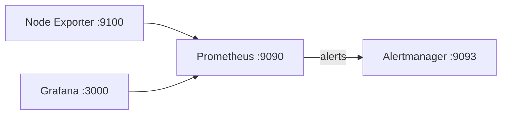

# DevOps Monitoring Sandbox on EC2 (Ubuntu)

Create a fully working monitoring sandbox on a single EC2 Ubuntu instance with Prometheus, Node Exporter, Alertmanager, and Grafana. All services run via systemd and are reachable on public_ip:port.

## Diagram


## What you get
- Prometheus 2.x with rules and targets
- Node Exporter 1.x for host metrics
- Alertmanager 0.x with example receiver
- Grafana 11.x with starter dashboard JSON
- Systemd units, logs, and helper scripts

## Prerequisites
- AWS account and IAM user able to create EC2, Security Groups, and Key Pairs
- Ubuntu 22.04 LTS AMI (recommended)
- Your local terminal with SSH access to the EC2 instance

## Step 1: Create EC2 instance
- **AMI**: Ubuntu Server 22.04 LTS (x86_64)
- **Instance type**: t3.small (2 vCPU, 2GB) or above
- **Storage**: 20 GB gp3
- **Network**: Place in a public subnet with Auto-assign public IP enabled
- **Key pair**: Create or select existing (PEM)
- **Security Group (inbound rules)**:
  - TCP 22 from your IP
  - TCP 3000 (Grafana) from 0.0.0.0/0 for demo
  - TCP 9090 (Prometheus) from 0.0.0.0/0 for demo
  - TCP 9093 (Alertmanager) from 0.0.0.0/0 for demo
  - TCP 9100 (Node Exporter) from 0.0.0.0/0 for demo

Note: For production, restrict sources to your IPs.

## Step 2: SSH and prepare
```bash
ssh -i /path/to/key.pem ubuntu@<EC2_PUBLIC_IP>
sudo apt-get update -y && sudo apt-get upgrade -y
sudo apt-get install -y git
```

## Step 3: Get this project onto the instance
Clone your fork
```bash
git clone https://github.com/CSD-FX/Sandbox_for_Monitoring_and_Alerting_-All-in-One-VM-.git
cd Sandbox_for_Monitoring_and_Alerting_-All-in-One-VM-
```

## Step 4: Install the stack
```bash
sudo bash scripts/install.sh
```
This will:
- Install Prometheus, Node Exporter, Alertmanager from GitHub releases
- Install Grafana via apt repo
- Create users, directories, systemd units
- Copy configs from this repo
- Start and enable services

## Step 5: Open the web UIs
- Prometheus: http://<EC2_PUBLIC_IP>:9090
- Alertmanager: http://<EC2_PUBLIC_IP>:9093
- Grafana: http://<EC2_PUBLIC_IP>:3000 (default admin/admin; you’ll be prompted to change)

## Step 6: Import dashboard in Grafana
- Login to Grafana
- Dashboards > New > Import
- Upload `grafana/dashboards/node_exporter_overview.json`
- Set data source: Prometheus (http://localhost:9090)

## Ports summary
- Prometheus: 9090
- Alertmanager: 9093
- Grafana: 3000
- Node Exporter: 9100

## Alerting configuration
- Prometheus rules located at `prometheus/rules/alerts.yml`
- Alertmanager config at `alertmanager/alertmanager.yml`

To customize receivers:
1. Edit `alertmanager/alertmanager.yml` with your email/Slack/webhook
2. Apply changes:
```bash
sudo cp alertmanager/alertmanager.yml /etc/alertmanager/alertmanager.yml
sudo systemctl reload alertmanager
```

## Helper scripts
- Check status of all services
```bash
bash scripts/status.sh
```
- Uninstall all components (dangerous)
```bash
sudo bash scripts/uninstall.sh
```

## Validate
```bash
curl -fsS http://localhost:9090/-/ready && echo "Prometheus ready"
curl -fsS http://localhost:9100/metrics | head
curl -fsS http://localhost:9093/#/status | head || true
```

## Troubleshooting
- Check service status
```bash
sudo systemctl status prometheus alertmanager node_exporter grafana-server
```
- Logs
```bash
journalctl -u prometheus -e --no-pager
journalctl -u alertmanager -e --no-pager
journalctl -u node_exporter -e --no-pager
journalctl -u grafana-server -e --no-pager
```
- Prometheus config test
```bash
promtool check config /etc/prometheus/prometheus.yml
promtool check rules /etc/prometheus/rules/*.yml
```

## Cleanup
```bash
sudo bash scripts/uninstall.sh
```
